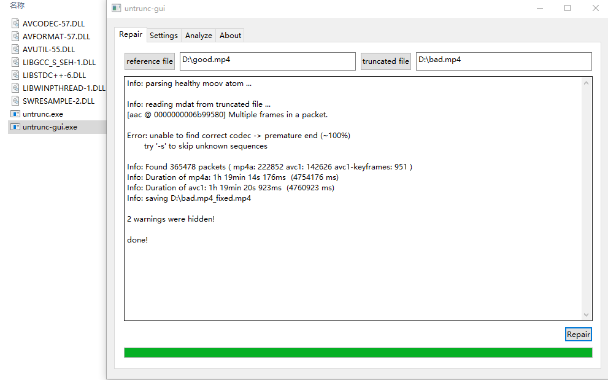
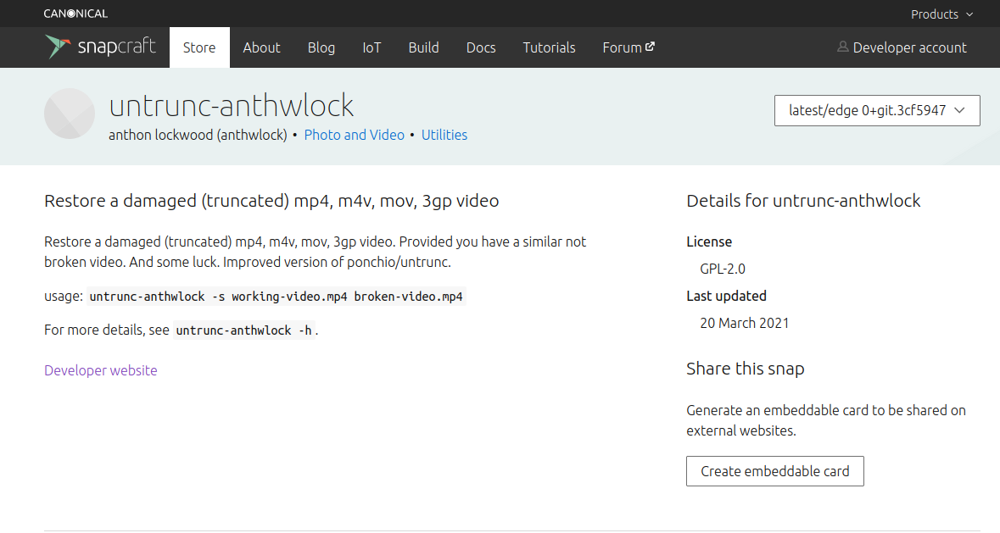
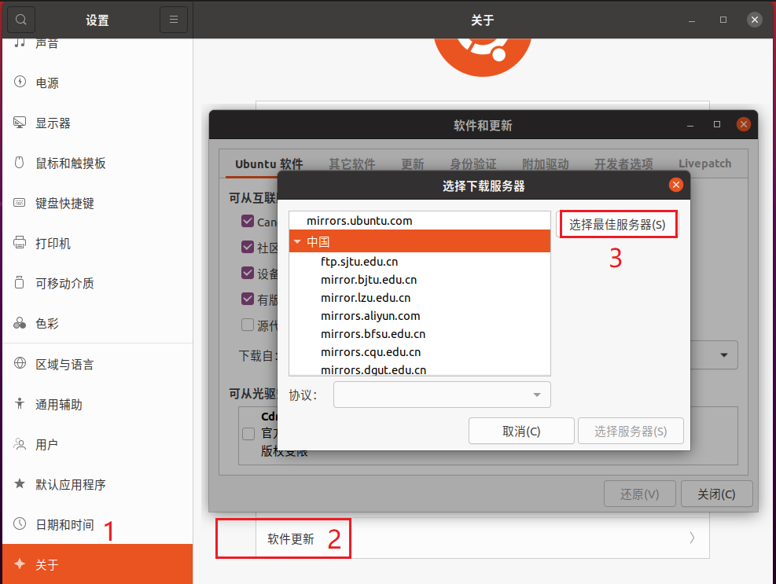

~~中文说明文档请点击此处~~ | [推荐另外一个作者的版本，安装更简洁，处理速度更快，并且支持Windows平台](#2)

# Introduction to untrunc

Appreciating author's project to make my video repaired successfully：https://github.com/ponchio/untrunc
### Installing（On Ubuntu 20.04.2.0 LTS）
●`  sudo su`switch to root environment

●`  apt install yasm make gcc g++`install yasm,etc. as you need

●`  wget https://github.com/ponchio/untrunc/archive/refs/heads/master.zip`download main program source code

●`  unzip master.zip`unzip the source code

●`  wget https://github.com/libav/libav/archive/refs/tags/v12.3.zip`download libav library

●`  mv -f /home/YourUserName/v12.3.zip /home/YourUserName/untrunc-master`in this step,you had better move the libav library to the /untrunc-master/ directory.the 'YourUserName' is what you set when installing linux.bye the way,recommend using the **absolute path** rather than relative path.

●`  cd /home/YourUserName/untrunc-master`change directory to /untrunc-master/

●`  unzip v12.3.zip`unzip the libav library

●`  cd /home/YourUserName/untrunc-master/libav-12.3`change directory to /libav-12.3/

●`  ./configure`check out the config

●`  make`building

●`  cd ..`back to the previous directory and **make sure you are in '/home/YourUserName/untrunc-master' so that you would compile successfully in next step**.

●`  g++ -o untrunc -I./libav-12.3 file.cpp main.cpp track.cpp atom.cpp codec_*.cpp codecstats.cpp codec.cpp mp4.cpp log.cpp -L./libav-12.3/libavformat -lavformat -L./libav-12.3/libavcodec -lavcodec -L./libav-12.3/libavresample -lavresample -L./libav-12.3/libavutil -lavutil -lpthread`

delete '**-lz**' in command line if you see such error like '**ld returned 1 exit status**'

### How to use
●`  cd /home/YourUserName/untrunc-master`change directory to /untrunc-master/

●`  ./untrunc /home/YourUserName/good.mp4 /home/YourUserName/bad.mp4`the 'bad.mp4' is what you need to restore,and the 'good.mp4' is reference which have the same or similar infomation compared with 'bad.mp4'.finally ,you will get a fixed mp4 file called 'bad.mp4_fixed.mp4' 

●  wait and enjoy!

<h1 id="1">untrunc中文说明文档</h1>

感谢作者提供的项目让我的视频起死回生：https://github.com/ponchio/untrunc
### 安装（On Ubuntu 20.04.2.0 LTS）
●`  sudo su`进入管理员模式

●`  apt update`更新apt源（国内用户需要先更新软件源才能正常安装下面的四个组件，[见下文](#3)）

●`  apt install yasm make gcc g++`安装这四个组件（当前系统版本是没有预装这四个组件的，老版本系统也建议检查一遍，以免后面编译报错。）

●`  wget https://github.com/ponchio/untrunc/archive/refs/heads/master.zip`下载主程序源码

●`  unzip master.zip`解压源码

●`  wget https://github.com/libav/libav/archive/refs/tags/v12.3.zip`下载libav库

●`  mv -f /home/YourUserName/v12.3.zip /home/YourUserName/untrunc-master`这一步是把根目录下载的v12.3.zip移动到untrunc-master目录中，'YourUserName'是你装linux系统的时候设置的用户名，推荐使用**绝对路径**万无一失，相对路径存在不稳定性，包括后面编译也要用到**绝对路径**，别嫌麻烦，动手敲吧！

●`  cd /home/YourUserName/untrunc-master`进入到untrunc-master目录

●`  unzip v12.3.zip`解压libav库

●`  cd /home/YourUserName/untrunc-master/libav-12.3`进入到libav-12.3目录

●`  ./configure`检测配置文件

●`  make`编译

●`  cd ..`返回上一级目录（一定要确保在/home/YourUserName/untrunc-master目录下才能进行下面的编译操作）

●`  g++ -o untrunc -I./libav-12.3 file.cpp main.cpp track.cpp atom.cpp codec_*.cpp codecstats.cpp codec.cpp mp4.cpp log.cpp -L./libav-12.3/libavformat -lavformat -L./libav-12.3/libavcodec -lavcodec -L./libav-12.3/libavresample -lavresample -L./libav-12.3/libavutil -lavutil -lpthread`

**1>作者的当前版本对于“相对路径”的支持很友好了，不会再出现之前类似“找不到XXX.cpp”的报错提示了。**

**2>作者原文给出的命令进行编译，会出现“ld returned 1 exit status”的报错提示，这种情况只需删除末尾的“-lz”参数即可。**

**3>如果是自主分区的系统，出现其他报错提示，这种情况只需在最后加上对应的参数即可，如下所示。**

●如果出现类似`  BZ2_bzDecompressInit`的报错提示，只需在末尾添加`  -lbz2`参数即可。

●如果出现类似`  lzma_stream_decoder`的报错提示，只需在末尾添加`  -llzma`参数即可。

●如果出现类似`  XOpenDisplay`的报错提示，只需在末尾添加`  -lX11`参数即可。

●如果出现类似`  VDPAU...`的报错提示，只需在末尾添加`  -lvdpau`参数即可。

●如果出现类似`  dlopen`的报错提示，只需在末尾添加`  -ldl`参数即可。

### 使用
●`  cd /home/YourUserName/untrunc-master`进入到untrunc-master文件夹

●`  ./untrunc /home/YourUserName/good.mp4 /home/YourUserName/bad.mp4`good.mp4是用来做参照物的，最好和损坏的视频格式、分辨率、编码一致，bad.mp4就是你需要修复的视频文件,最后命令结束后会生成文件名为bad.mp4_fixed.mp4的修复文件

●  wait and enjoy!

<h1 id="2">另外一个版本</h1>

作者：https://github.com/anthwlock/untrunc
## Windows用户

Windows用户只需点击[这个链接](https://github.com/anthwlock/untrunc/releases)，下载压缩包，解压后运行"untrunc-gui.exe"这个应用程序即可，如下图所示

左侧good.mp4是用来做参照物的，最好和损坏的视频格式、分辨率、编码一致，右侧bad.mp4就是你需要修复的视频文件,点击Repair进行修复，最后会生成文件名为bad.mp4_fixed.mp4的修复文件（注意避免出现中文路径）

## Linux用户

<h6> 方案一</h6>

从Ubuntu 20 开始，系统自带Snap应用商店，现在可以直接在Snap Store获取已经编译好的应用。

●`  sudo snap install --edge untrunc-anthwlock`安装已经编译好的应用

●`  untrunc-anthwlock -s /home/YourUserName/good.mp4 /home/YourUserName/bad.mp4`good.mp4是用来做参照物的，最好和损坏的视频格式、分辨率、编码一致，bad.mp4就是你需要修复的视频文件,最后命令结束后会生成文件名为bad.mp4_fixed.mp4的修复文件

●  wait and enjoy!

<h6 id="3"> 方案二</h6>

国内用户请参考下图先将软件源更新成最佳位置：

●`  sudo su`进入管理员模式

●`  apt update`更新apt源

●`  apt install yasm make gcc g++`安装这四个组件（当前系统版本是没有预装这四个组件的，老版本系统也建议检查一遍，以免后面编译报错）

●`  wget https://github.com/anthwlock/untrunc/archive/refs/heads/master.zip`下载主程序源码

●`  unzip master.zip`解压源码

●`  cd untrunc-master`进入到untrunc-master目录

●`  make FF_VER=3.3.9`编译

### 使用
●`  cd /home/YourUserName/untrunc-master`进入到untrunc-master文件夹

●`  ./untrunc /home/YourUserName/good.mp4 /home/YourUserName/bad.mp4`good.mp4是用来做参照物的，最好和损坏的视频格式、分辨率、编码一致，bad.mp4就是你需要修复的视频文件,最后命令结束后会生成文件名为bad.mp4_fixed.mp4的修复文件

●  wait and enjoy!
